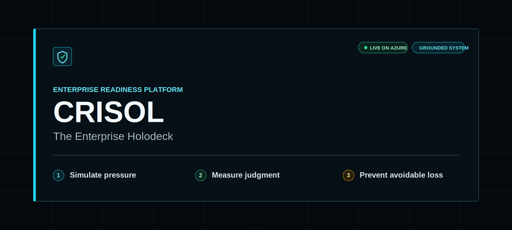
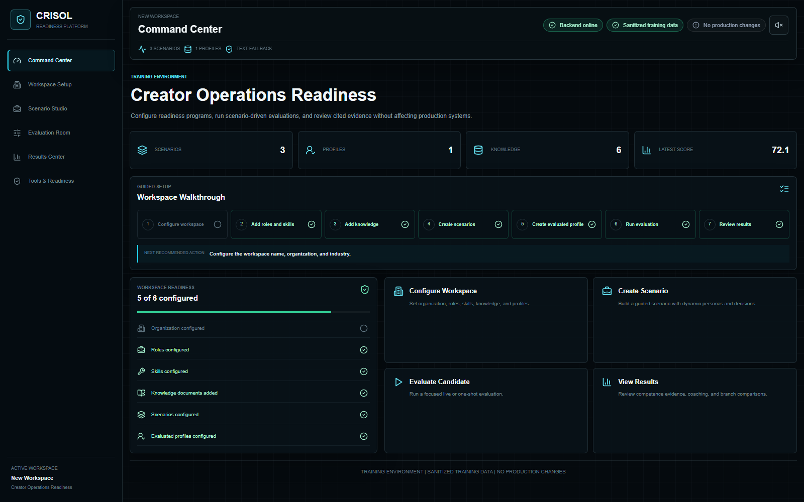
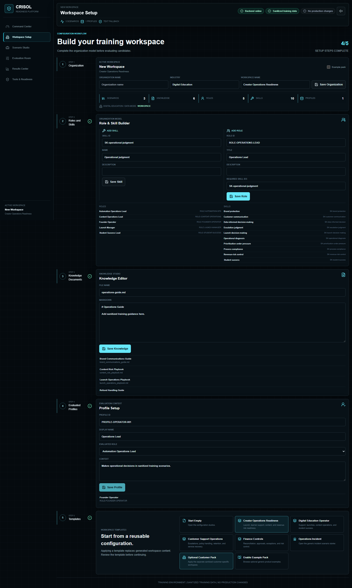
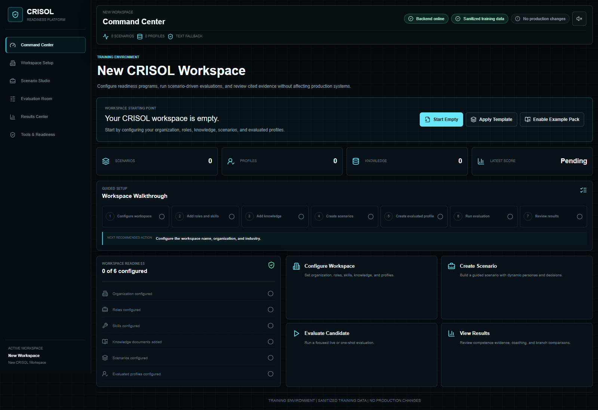
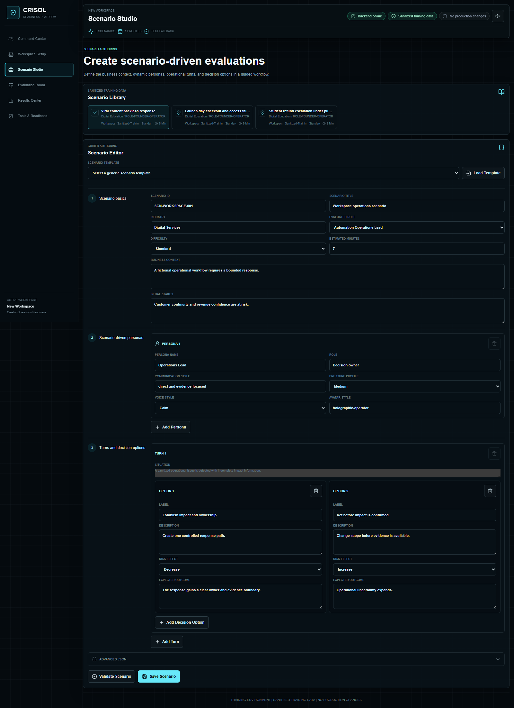
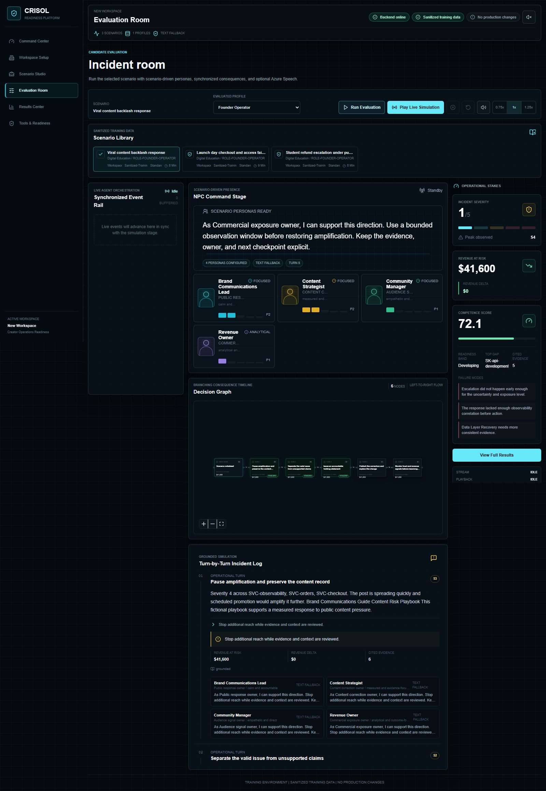
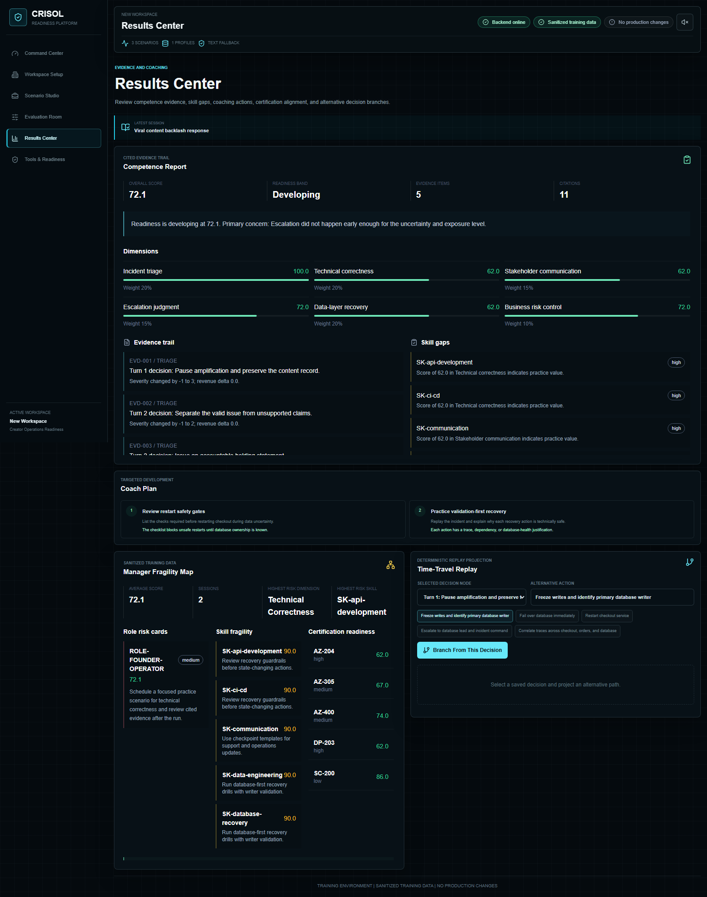
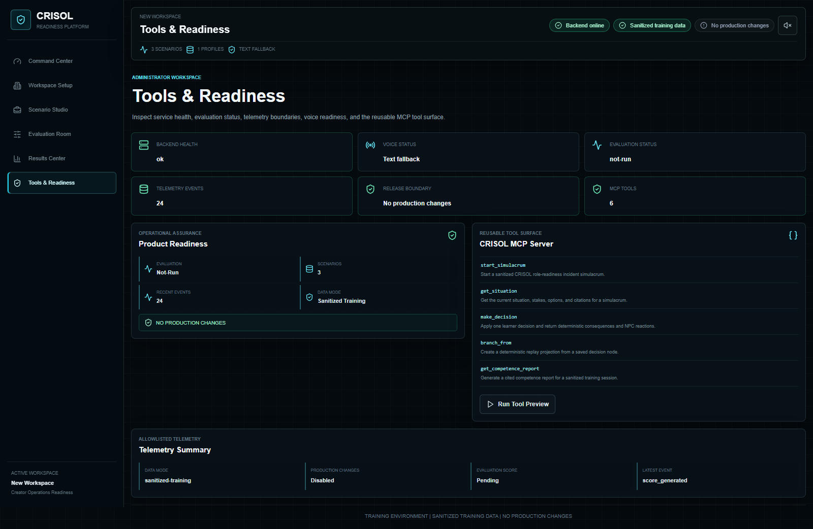
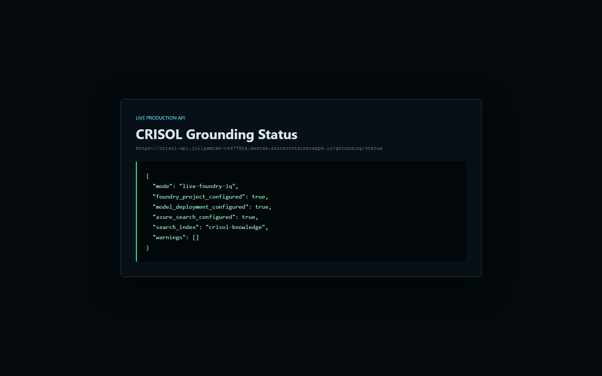
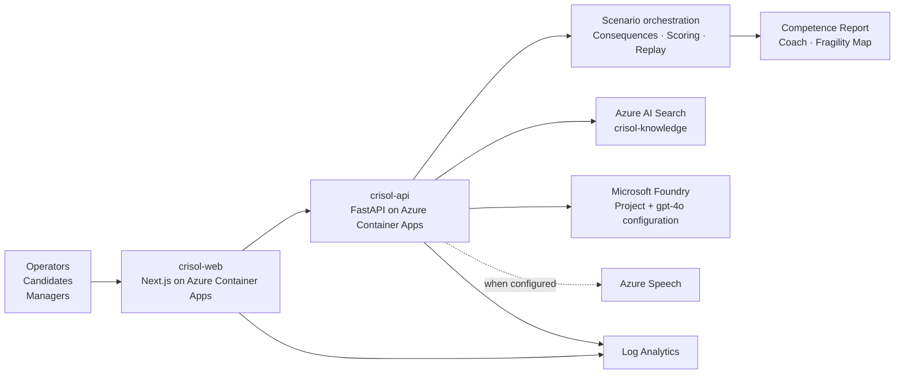

<p align="center">
  
</p>

<p align="center">
  <a href="https://crisol-web.jollysmoke-c46778ba.eastus.azurecontainerapps.io">
    
  </a>
  <a href="https://crisol-api.jollysmoke-c46778ba.eastus.azurecontainerapps.io/health">
    
  </a>
  <a href="https://crisol-api.jollysmoke-c46778ba.eastus.azurecontainerapps.io/grounding/status">
    
  </a>
  
</p>

<h1 align="center">CRISOL - The Enterprise Holodeck</h1>

<p align="center">
  <strong>A configurable enterprise simulation platform that turns organizational knowledge into live decision drills, measurable competence, and manager-ready risk insight.</strong>
</p>

<p align="center">
  <strong>Simulate pressure</strong> &nbsp;|&nbsp;
  <strong>Measure judgment</strong> &nbsp;|&nbsp;
  <strong>Prevent avoidable loss</strong>
</p>

> **CRISOL gives leaders a safe environment to observe how people use
> knowledge when the situation is incomplete, the stakes are rising, and the
> next decision matters.**

## Contents

- [Executive summary](#executive-summary)
- [The problem](#the-problem)
- [Why it matters](#why-it-matters)
- [The solution](#the-solution)
- [Product walkthrough](#product-walkthrough)
- [Core capabilities](#core-capabilities)
- [Live system status](#live-system-status)
- [Microsoft architecture](#microsoft-architecture)
- [Technical summary](#technical-summary)
- [How it works](#how-it-works)
- [Why CRISOL is different](#why-crisol-is-different)
- [Security and responsible data](#security-and-responsible-data)
- [Local setup](#local-setup)
- [Azure deployment](#azure-deployment)
- [Validation](#validation)
- [Roadmap](#roadmap)

## Executive summary

CRISOL is an operating simulator for enterprise judgment. Organizations
configure the roles, skills, knowledge, scenarios, and stakeholder personas
that define readiness in their environment. Participants then work through
high-pressure decision drills while CRISOL models consequences, preserves
evidence, scores competence, and produces coaching and manager-level insight.

The result is a measurable readiness loop:

1. Convert organizational knowledge into an executable scenario.
2. Observe decisions under pressure rather than testing recall.
3. Connect actions to evidence, consequences, and business exposure.
4. Identify fragile skills before they surface in a real incident.
5. Replay alternate decisions without changing production systems.

## The problem

Organizations rarely fail because no knowledge exists. They fail because the
right person does not see, trust, interpret, or act on the right knowledge at
the right moment.

Static documentation cannot show whether someone will escalate early enough.
Course completion cannot prove decision ownership. A quiz cannot recreate
competing stakeholders, incomplete evidence, rising exposure, or the cost of a
poorly timed action.

Readiness gaps therefore remain invisible until they appear inside an outage,
failed launch, customer escalation, audit finding, control failure, or
operational loss.

## Why it matters

CRISOL is designed to help leaders model avoidable cost before it becomes real
loss.

| Readiness failure | Business consequence | What CRISOL measures or helps prevent |
| --- | --- | --- |
| Delayed escalation | Wider incident scope and slower containment | Escalation timing, evidence quality, and decision ownership |
| Fragmented knowledge | Conflicting actions and repeated discovery work | Whether the participant finds and applies grounded guidance |
| Ambiguous ownership | Coordination delay and accountability gaps | Clear owner selection and stakeholder alignment |
| Inconsistent onboarding | Uneven performance across teams and locations | Role-specific decisions against a shared scenario standard |
| Unsupported action under uncertainty | Avoidable operational and customer impact | Validation discipline, risk control, and consequence awareness |
| Weak customer communication | Trust erosion and prolonged escalation | Communication quality, cadence, and evidence use |
| Undocumented judgment | Institutional knowledge loss | Cited evidence trails and replayable decision history |
| Repeated incident patterns | Recurring modeled exposure | Skill fragility, coaching needs, and alternate response paths |

Modeled severity and revenue-at-risk signals are training constructs. They are
not observed customer loss, financial forecasts, or guaranteed ROI.

## The solution

CRISOL creates a configurable enterprise holodeck:

- **Build the environment** - Define organization context, roles, skills,
  profiles, and sanitized knowledge.
- **Design the pressure** - Author operational scenarios, personas, decision
  options, consequences, and expected outcomes.
- **Run the drill** - Execute one-shot or synchronized incident-room
  simulations.
- **Measure the response** - Score competence with cited evidence and
  consequence history.
- **Improve the system** - Generate coaching, manager fragility insight, and
  alternate replay branches.

> CRISOL does not ask, "Did the participant remember the answer?" It asks,
> "What did they do when the answer was distributed, the evidence was
> incomplete, and the business was exposed?"

## Product walkthrough

The walkthrough follows the product lifecycle from an empty workspace to
evidence-backed results.

### 1. Command Center



*A single operating view for workspace readiness, configured assets, and the
next recommended action.*

The Command Center gives program owners a clear path into workspace
configuration, scenario authoring, candidate evaluation, and results.

### 2. Workspace Setup



*Roles, skills, knowledge, evaluated profiles, and reusable templates are
configured inside one bounded workspace.*

CRISOL can start empty, allowing each organization to define readiness without
inheriting customer data or assumptions.

<details>
<summary><strong>View Empty Workspace Mode</strong></summary>



*A clean starting state with no scenarios, profiles, or workspace knowledge.*

</details>

### 3. Scenario Studio



*Scenario authors define business context, stakeholder pressure, decision
options, and expected consequences.*

The guided editor keeps scenarios structured while preserving an advanced JSON
surface for complete control.

### 4. Evaluation Room



*A live incident room combines personas, operational stakes, branching
consequences, grounded evidence, and competence signals.*

Participants experience the scenario as a synchronized decision environment,
not as a sequence of disconnected questions.

### 5. Results Center



*Competence evidence becomes a score, skill-gap analysis, coach plan, manager
fragility map, and replayable decision path.*

Every result remains connected to the decisions and citations that produced
it.

### 6. Tools & Readiness



*Operational health, evaluation state, telemetry boundaries, MCP tools, and
release safeguards remain visible to administrators.*

The product separates platform readiness from participant performance.

### 7. Live Grounding Boundary



*The public status contract reports the active grounding mode without exposing
credentials or private endpoints.*

CRISOL only reports a live grounding mode after a lightweight Azure AI Search
probe succeeds.

## Core capabilities

| Configure | Simulate | Measure | Operate |
| --- | --- | --- | --- |
| Empty Workspace Mode | Scenario-driven personas | Competence Score | Azure Container Apps deployment |
| Organization Workspace | Live Evaluation Room | Cited Evidence Trail | Live grounding status |
| Role & Skill Builder | Branching Consequence Timeline | Coach Plan | MCP-compatible tool surface |
| Knowledge Studio | Optional Azure Speech personas | Manager Fragility Map | Telemetry and evaluation checks |
| Scenario Studio | Modeled severity and exposure | Time-Travel Replay | Workspace export and import |
| Evaluated Profiles | Synchronized event playback | Certification alignment | Security and repository scans |

## Live system status

Verified against the public production endpoints on **June 11, 2026**:

| Signal | Status |
| --- | --- |
| Frontend | [Live `crisol-web`](https://crisol-web.jollysmoke-c46778ba.eastus.azurecontainerapps.io) |
| Backend | [Healthy `crisol-api`](https://crisol-api.jollysmoke-c46778ba.eastus.azurecontainerapps.io/health) |
| Grounding mode | `live-foundry-iq` |
| Foundry project configured | Yes |
| Model deployment configured | Yes - `gpt-4o` |
| Azure AI Search configured | Yes |
| Search index | `crisol-knowledge` |
| Grounding warnings | None |
| Azure Speech integration | Implemented |
| Production voice status | Text-only fallback; Speech credentials are not active |

The grounding status is independently verifiable at
[`GET /grounding/status`](https://crisol-api.jollysmoke-c46778ba.eastus.azurecontainerapps.io/grounding/status).
The voice boundary is independently verifiable at
[`GET /voice/status`](https://crisol-api.jollysmoke-c46778ba.eastus.azurecontainerapps.io/voice/status).

## Microsoft architecture

CRISOL uses Microsoft services where they improve the product boundary, while
keeping deterministic local operation and explicit fallbacks.



### Azure service map

| Azure capability | Product responsibility |
| --- | --- |
| Azure Container Apps | Hosts the public Next.js frontend and FastAPI backend |
| Container Apps Environment `crisol-env` | Provides the shared managed runtime boundary |
| Azure Container Registry | Stores and builds deployable container images |
| Azure AI Search | Executes live grounded retrieval over `crisol-knowledge` |
| Microsoft Foundry project | Provides the configured project and model deployment boundary |
| `gpt-4o` deployment configuration | Satisfies the current Foundry readiness contract |
| Azure Speech | Supports voice-enabled personas when credentials are configured |
| Log Analytics | Receives Container Apps platform and application logs |
| MCP-compatible tools | Expose scenario, decision, replay, report, and insight operations |

> **Architecture boundary:** live retrieval is performed by Azure AI Search.
> The Foundry project endpoint and model deployment are configured and reported
> by the readiness contract; CRISOL does not claim a hosted Foundry agent
> runtime where one is not implemented.

Architecture documentation:

- [Executive architecture](docs/ARCHITECTURE_EXECUTIVE.md)
- [Technical architecture](docs/ARCHITECTURE_TECHNICAL.md)
- [Architecture diagrams](docs/ARCHITECTURE_DIAGRAM.md)
- [Architecture index](docs/ARCHITECTURE.md)

## Technical summary

CRISOL is a Next.js application backed by a FastAPI service. The backend
combines workspace storage, scenario services, deterministic multi-agent
orchestration, grounded retrieval, consequence modeling, competence scoring,
replay, MCP tools, voice synthesis, telemetry, and release validation.

| Component | Role | Microsoft dependency | Notes |
| --- | --- | --- | --- |
| Frontend | Product shell and six operating surfaces | Azure Container Apps | Next.js; backend URL supplied through `NEXT_PUBLIC_CRISOL_API_URL` |
| Backend | HTTP, SSE, audio, workspace, and reporting contracts | Azure Container Apps | FastAPI and Uvicorn |
| Workspace Store | Validated organization, role, skill, knowledge, profile, and scenario state | None required | Generated workspace data remains outside Git |
| Scenario Engine | Drives turns, personas, decisions, and scenario selection | None required | Deterministic and usable offline |
| Grounding Layer | Selects live retrieval or cited local fallback | Azure AI Search | Returns explicit `grounding_mode` metadata |
| Azure AI Search | Searches sanitized knowledge | Azure AI Search | Production index: `crisol-knowledge` |
| Foundry Project Endpoint | Reports project and model readiness | Microsoft Foundry | Configured with `gpt-4o`; Search remains the live retrieval path |
| Azure Speech | Synthesizes persona lines | Azure Speech | Optional; current production uses text fallback |
| Consequence Engine | Models severity, systems, exposure, and decision branches | None required | No production actions |
| Scoring & Insights | Generates reports, coaching, and aggregate fragility | None required | Evidence remains cited |
| MCP Surface | Exposes six reusable CRISOL operations | MCP-compatible clients | Uses the same core services as the web API |
| Replay Layer | Projects alternate paths from saved decisions | None required | Deterministic training projection |
| Telemetry & Validation | Enforces data, endpoint, security, and release contracts | Log Analytics for deployed logs | Local validation remains available |

## How it works

1. **Start empty** - Open a workspace without inherited organization data.
2. **Configure the workspace** - Define organization context, roles, skills,
   and evaluated profiles.
3. **Add knowledge** - Store sanitized operational documents.
4. **Build the scenario** - Define business stakes, turns, and decisions.
5. **Activate personas** - Attach stakeholder roles, communication styles, and
   pressure profiles.
6. **Run the evaluation** - Execute a one-shot or synchronized simulation.
7. **Update consequences** - Model severity, affected systems, and exposure
   after each decision.
8. **Score competence** - Generate dimensions, evidence, gaps, and coaching.
9. **Review organizational risk** - Aggregate signals in the Manager Fragility
   Map.
10. **Replay an alternate branch** - Project another decision from a saved
    timeline node.

See the [runtime sequence](docs/ARCHITECTURE_DIAGRAM.md#evaluation-runtime-sequence).

## Why CRISOL is different

| CRISOL is not | Because | CRISOL is |
| --- | --- | --- |
| A chatbot | Conversation alone does not model structured consequences or competence | A scenario-driven decision simulator |
| A static LMS | Completion and content consumption do not prove judgment | An executable readiness environment |
| A quiz | Multiple-choice recall removes pressure, ambiguity, and ownership | A branching operating exercise |
| A dashboard | Visualizing historical metrics does not create practice | A system for generating new readiness evidence |
| A production automation tool | Training should not change live systems | A production-safe simulation boundary |

**CRISOL is an interactive operating simulator for organizational judgment.**

## Security and responsible data

- Sanitized enterprise training data is the default and required boundary.
- Simulations make no production changes.
- `.env` files and secrets remain outside source control.
- Generated sessions, audio, telemetry, exports, dependencies, and build
  output are ignored.
- No real employee or customer PII is required.
- Azure Search indexing validates the data classification before upload.
- Grounding has an explicit local fallback for offline development and cloud
  failure.
- Repository validation scans for credentials, sensitive data patterns,
  attribution language, and prohibited product copy.
- Manager insights aggregate readiness evidence without exposing participant
  identity.

See [Security](docs/SECURITY.md) and
[Environment configuration](docs/ENVIRONMENT.md).

## Local setup

### Backend

```powershell
cd backend
python -m venv .venv
.\.venv\Scripts\Activate.ps1
python -m pip install -r requirements.txt
python -m app.validate_release
python -m uvicorn app.main:app --reload --host 127.0.0.1 --port 8010
```

### Frontend

Open a second PowerShell terminal:

```powershell
cd frontend
npm install
$env:NEXT_PUBLIC_CRISOL_API_URL="http://127.0.0.1:8010"
npm run dev -- -p 3001
```

Open `http://127.0.0.1:3001`.

Cloud credentials are optional for local development. Grounding and voice
retain bounded fallbacks.

## Azure deployment

The deployment uses separate frontend and backend images, Azure Container
Registry builds, external Container Apps ingress, environment-based CORS, and
Container Apps secret references.

- [Azure deployment commands](docs/AZURE_DEPLOYMENT_COMMANDS.md)
- [Foundry IQ and Azure AI Search setup](docs/FOUNDRY_IQ_SETUP.md)
- [Deployment guide](docs/DEPLOYMENT.md)

## Validation

Backend:

```powershell
cd backend
python -m app.validate_submission
python -m app.validate_release
python -m app.validate_foundry_iq
python -m app.validate_workspace_package
python -m app.validate_dynamic_personas
```

Frontend:

```powershell
cd frontend
npm run build
```

Documentation assets:

```powershell
npm install --prefix tools
npm exec --prefix tools playwright install chromium
npm run --prefix tools capture:screenshots
```

## Roadmap

- Enterprise SSO and role-based administration.
- Multi-tenant workspace isolation.
- HRIS and LMS integration.
- Richer Foundry Agent Service integration.
- Scenario marketplace and governed template distribution.
- Manager benchmarking across comparable role cohorts.
- Audit-ready report export and retention policies.

## Demo video

**Demo video: coming soon.**
