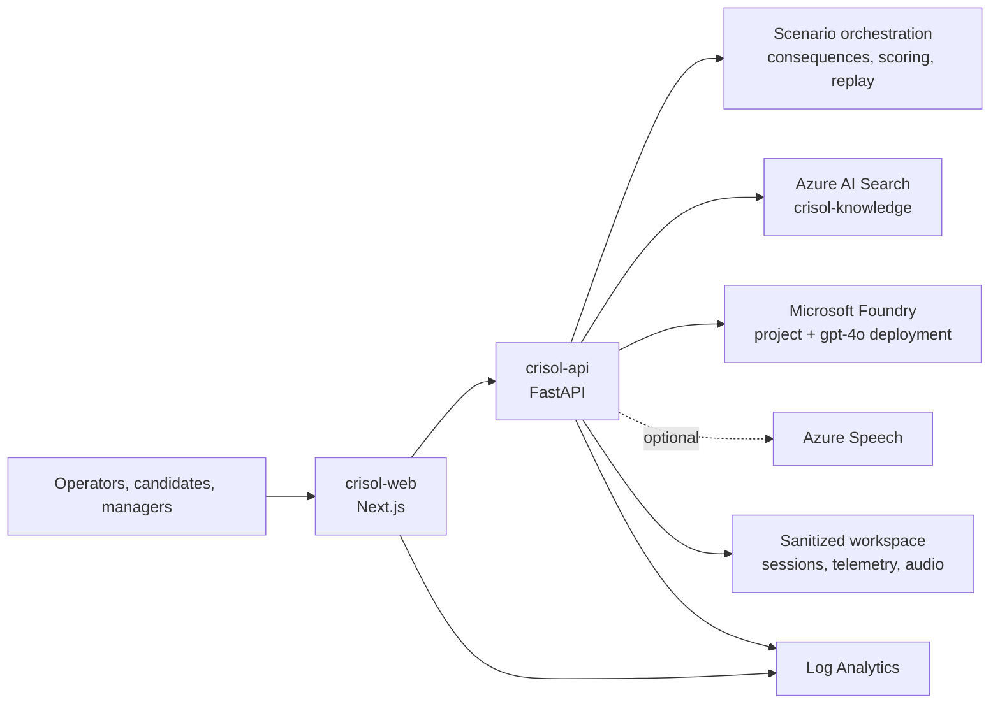

<p align="center">
  
</p>

# CRISOL - The Enterprise Holodeck

**A configurable enterprise simulation platform that turns organizational
knowledge into live decision drills, measurable competence, and manager-ready
risk insight.**

[Open the live product](https://crisol-web.jollysmoke-c46778ba.eastus.azurecontainerapps.io)
| [Backend health](https://crisol-api.jollysmoke-c46778ba.eastus.azurecontainerapps.io/health)
| [Grounding status](https://crisol-api.jollysmoke-c46778ba.eastus.azurecontainerapps.io/grounding/status)

## The problem

Organizations do not fail because knowledge does not exist. They fail because
the right person does not see, trust, or act on the right knowledge under
pressure.

Traditional training measures recall. CRISOL measures decisions under
pressure: what someone notices, which action they own, how they communicate,
when they escalate, and how their choices change operational and commercial
exposure.

Skill gaps are usually discovered after an incident, escalation, outage,
customer churn event, audit finding, failed launch, or operational loss. By
then, the organization is paying for a readiness gap it could not see.

## The cost of invisible readiness gaps

- Delayed escalation when uncertainty is highest.
- Wrong or ambiguous decision ownership.
- Fragmented knowledge across documents, systems, and teams.
- Critical judgment that remains undocumented.
- Repeated incidents with the same underlying failure pattern.
- Inconsistent onboarding and role-transition outcomes.
- Avoidable revenue leakage during operational disruption.
- Brand and customer trust risk from uneven response quality.

**CRISOL is designed to help leaders model avoidable cost before it becomes
real loss.**

## The solution

CRISOL creates a safe enterprise holodeck where teams can configure an
organization workspace, connect sanitized knowledge, define roles and skills,
author scenarios, assemble pressure-tested personas, and evaluate decisions
through live incident-room simulations.

Every run produces an evidence trail. Decisions branch into consequences.
Competence is scored against scenario expectations. Managers receive aggregate
fragility signals, and teams can replay an alternate decision from any saved
node without touching production systems.

## Product walkthrough

### Command Center

The operating view for workspace readiness, configured assets, recommended
actions, and access to the core evaluation workflow.


### Empty Workspace Mode

CRISOL starts clean. Teams can build their own workspace or apply a reusable,
sanitized configuration.


### Workspace Setup

Configure organization context, roles, skills, knowledge documents, evaluated
profiles, and reusable workspace templates.


### Scenario Studio

Author business context, personas, pressure profiles, operational turns,
decision options, expected outcomes, and evaluation criteria.


### Evaluation Room

Run a synchronized incident simulation with scenario-driven personas,
branching consequences, operational stakes, cited evidence, and a live
competence signal.


### Results Center

Review the competence report, evidence trail, skill gaps, coach plan, manager
fragility map, and alternate decision branches.


### Tools & Readiness

Inspect service health, telemetry boundaries, reusable MCP tools, evaluation
status, and operational safeguards.


### Live grounding status

The public API reports the active grounding boundary without exposing
credentials or internal endpoints.


## Core capabilities

- **Empty Workspace Mode** - Begin without inherited organization data.
- **Configurable Organization Workspace** - Model organization, industry, and
  workspace context.
- **Role & Skill Builder** - Define role expectations and measurable skills.
- **Knowledge Studio** - Add sanitized operational guidance and cited evidence.
- **Scenario Studio** - Build reusable decision drills and evaluation paths.
- **Scenario-driven NPC Personas** - Configure stakeholder roles,
  communication styles, pressure profiles, and voice styles.
- **Live Evaluation Room** - Run one-shot or synchronized simulations.
- **Azure Speech Incident Room** - Use Azure Speech when configured, with a
  synchronized text fallback.
- **Branching Consequence Timeline** - See severity, exposure, and system
  effects across each decision.
- **Competence Score** - Measure weighted decision dimensions.
- **Evidence Trail** - Preserve cited observations behind every result.
- **Coach Plan** - Turn gaps into targeted practice.
- **Manager Fragility Map** - Aggregate readiness risk without requiring PII.
- **Time-Travel Replay** - Project an alternate path from a saved decision.
- **MCP Tool Surface** - Invoke CRISOL capabilities through reusable tools.
- **Telemetry / Eval / Security Guardrails** - Validate release boundaries,
  data classification, citations, and repository hygiene.
- **Workspace Export / Import** - Move validated workspace packages without
  committing generated runtime data.

## Microsoft and Azure architecture

CRISOL runs as two production containers in Azure:

- **Azure Container Apps** hosts `crisol-web` and `crisol-api`.
- **Azure Container Apps Environment** `crisol-env` provides the shared
  managed runtime.
- **Azure Container Registry** stores deployment images.
- **Azure AI Search** provides live grounded retrieval over the
  `crisol-knowledge` index.
- **Microsoft Foundry** project and `gpt-4o` deployment configuration satisfy
  the live Foundry IQ readiness boundary.
- **Azure Speech** is the optional voice provider for scenario personas; text
  fallback keeps evaluations available when speech is not configured.
- **Log Analytics** supports platform and container visibility.
- **MCP-compatible tools** expose scenario, decision, replay, report, and
  manager-insight actions programmatically.

Azure AI Search performs live retrieval over sanitized knowledge. Local cited
retrieval remains available for offline development and cloud failure
fallback. Simulations do not modify production systems.

See [Architecture](docs/ARCHITECTURE.md) and the
[full architecture diagram](docs/ARCHITECTURE_DIAGRAM.md).

## Live production status

Verified on **June 11, 2026**:

| Signal | Production value |
| --- | --- |
| Frontend | [crisol-web](https://crisol-web.jollysmoke-c46778ba.eastus.azurecontainerapps.io) |
| Backend | [crisol-api](https://crisol-api.jollysmoke-c46778ba.eastus.azurecontainerapps.io) |
| Backend health | `ok` |
| Grounding mode | `live-foundry-iq` |
| Search index | `crisol-knowledge` |
| Foundry project configured | Yes |
| Model deployment configured | Yes |
| Azure AI Search configured | Yes |
| Grounding warnings | None |

The status endpoint performs a live Search probe before reporting a live
grounding mode.

## Architecture diagram



## How CRISOL works

1. **Start empty** with no inherited organization context.
2. **Configure the workspace** with organization, role, and skill definitions.
3. **Add knowledge** using sanitized operational documents.
4. **Build a scenario** around a decision under pressure.
5. **Define personas** that represent scenario stakeholders.
6. **Evaluate a candidate** through a live or one-shot simulation.
7. **Review results** with cited competence evidence and coaching.
8. **Replay an alternate branch** from a saved decision node.
9. **Export insights** through workspace packages and reports.

## Why it is different

CRISOL is not a chatbot. It is not a quiz. It is not a dashboard, and it is
not static training.

**CRISOL is an interactive operating simulator for organizational judgment.**

It connects knowledge, business stakes, stakeholder pressure, consequences,
evidence, and coaching in one decision loop.

## Responsible data and security

- Repository examples use sanitized enterprise training data.
- Simulations perform no production changes.
- Secrets are not stored in source control.
- `.env` files are ignored.
- Generated sessions, audio, telemetry, exports, dependencies, and build
  output are ignored.
- Local cited fallback remains available without cloud credentials.
- Release validation scans for credentials and sensitive-data patterns.
- No PII is required for scenario evaluation or manager insights.
- Workspace content is isolated behind validated storage and package
  boundaries.

See [Security](docs/SECURITY.md) and
[Environment configuration](docs/ENVIRONMENT.md).

## Local setup

### Backend

```powershell
cd backend
python -m venv .venv
.\.venv\Scripts\Activate.ps1
python -m pip install -r requirements.txt
python -m app.validate_release
python -m uvicorn app.main:app --reload --host 127.0.0.1 --port 8010
```

### Frontend

Open a second PowerShell terminal:

```powershell
cd frontend
npm install
$env:NEXT_PUBLIC_CRISOL_API_URL="http://127.0.0.1:8010"
npm run dev -- -p 3001
```

Open `http://127.0.0.1:3001`.

## Azure deployment

The production topology uses Azure Container Apps with separate frontend and
backend images. Deployment commands use placeholders and secret references;
credentials are never embedded in images or documentation.

See [Azure deployment commands](docs/AZURE_DEPLOYMENT_COMMANDS.md) and
[Foundry IQ setup](docs/FOUNDRY_IQ_SETUP.md).

## Validation

Backend:

```powershell
cd backend
python -m app.validate_submission
python -m app.validate_release
python -m app.validate_foundry_iq
python -m app.validate_workspace_package
python -m app.validate_dynamic_personas
```

Frontend:

```powershell
cd frontend
npm run build
```

Screenshot capture:

```powershell
npm install --prefix tools
npm exec --prefix tools playwright install chromium
npm run --prefix tools capture:screenshots
```

## Repository hygiene

The repository excludes generated and sensitive local state:

- `.env`
- `.venv/`
- `node_modules/`
- `.next/`
- `dist/`
- `backend/.crisol_sessions/`
- `backend/.crisol_audio/`
- `backend/.crisol_telemetry/`
- `backend/.crisol_exports/`
- generated workspace content

## Roadmap

- Enterprise SSO.
- Multi-tenant workspace isolation.
- HRIS and LMS integration.
- Richer Foundry Agent Service integration.
- Scenario marketplace.
- Manager benchmarking.
- Audit-ready report export.

## Demo video

**Demo video: coming soon.**
