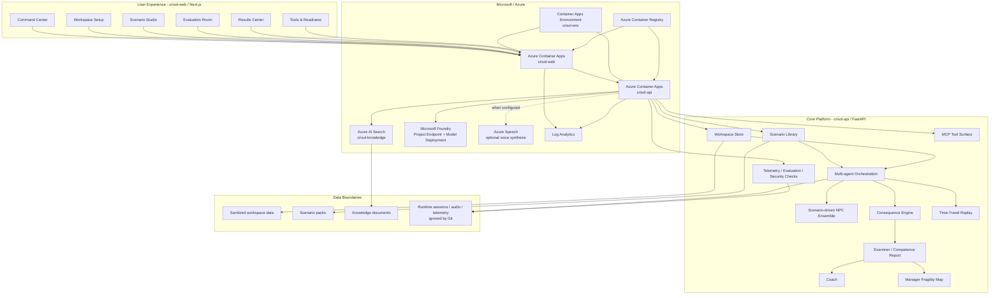
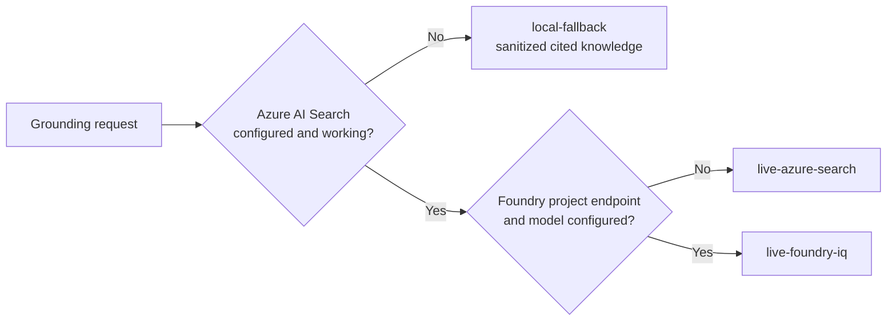

# CRISOL Architecture Diagram

## Grounding modes

`live-foundry-iq` is the active production status as of June 11, 2026. Azure
AI Search performs live grounded retrieval. Local fallback remains available
for offline development and service failure. Simulations do not modify
production systems.
