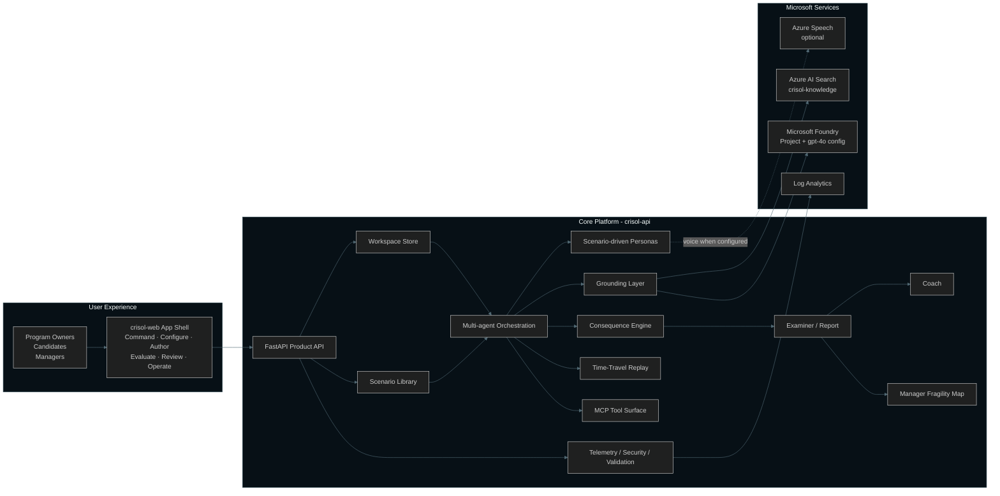
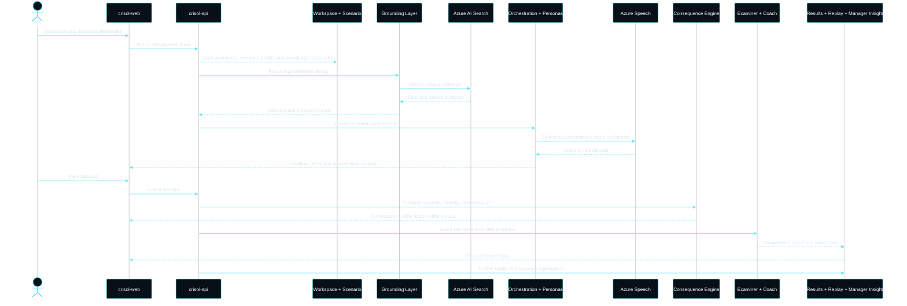
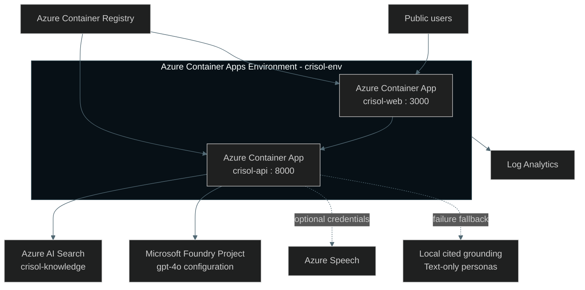
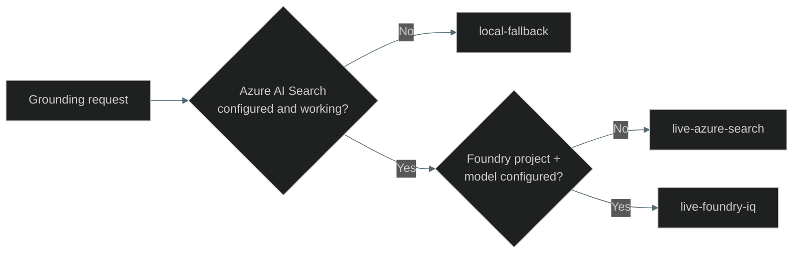

# CRISOL Architecture Diagrams

## System overview

Source: [`diagrams/01-system-overview.mmd`](diagrams/01-system-overview.mmd)

## Evaluation runtime sequence

Source: [`diagrams/02-runtime-sequence.mmd`](diagrams/02-runtime-sequence.mmd)

## Azure topology

Source: [`diagrams/03-azure-topology.mmd`](diagrams/03-azure-topology.mmd)

## Grounding modes

The live production grounding status is `live-foundry-iq`. Azure AI Search
performs retrieval; local cited grounding remains the failure and offline
fallback.
