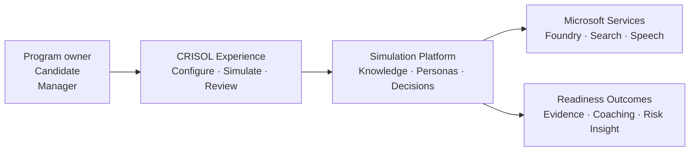

# CRISOL Executive Architecture

## Architecture in one sentence

CRISOL converts sanitized organizational knowledge into pressure-tested
decision simulations, then turns each action into evidence, competence
measurement, coaching, and manager-ready risk insight.

## Business flow

## Six architectural stages

| Stage | What happens | Business value |
| --- | --- | --- |
| Configure | Leaders define roles, skills, scenarios, profiles, and sanitized knowledge. | Readiness reflects the organization rather than a generic curriculum. |
| Ground | Azure AI Search retrieves evidence from the approved knowledge index. | Decisions remain connected to relevant operational guidance. |
| Simulate | Scenario-driven personas introduce pressure, uncertainty, and competing priorities. | Participants practice judgment in context. |
| Model | The consequence engine updates severity, systems, and modeled exposure. | Leaders can observe the operational meaning of each decision. |
| Measure | The Examiner produces cited competence evidence and skill gaps. | Assessment becomes explainable and actionable. |
| Improve | Coaching, manager fragility insight, and replay turn results into the next practice cycle. | Readiness becomes a continuous operating discipline. |

## Microsoft platform fit

CRISOL uses Microsoft services as bounded platform capabilities:

- **Azure Container Apps** provides managed hosting for the public web and API
  containers.
- **Azure AI Search** provides live grounded retrieval over sanitized
  knowledge.
- **Microsoft Foundry** provides the configured project and model deployment
  boundary.
- **Azure Speech** supports voice-enabled personas when credentials are active.
- **Log Analytics** supports deployed operational visibility.
- **MCP-compatible tools** make CRISOL operations reusable beyond the web
  interface.

The product remains usable when optional cloud capabilities are unavailable:
local cited grounding and text-only persona delivery preserve the core
simulation.

## Trust boundary

CRISOL is designed for training and readiness analysis:

- It uses sanitized data.
- It requires no real employee or customer PII.
- It does not execute production actions.
- It does not present modeled exposure as observed financial loss.
- It preserves citations and decision evidence behind results.

## Outcome

CRISOL gives leaders a repeatable way to answer three questions:

1. How does this role make decisions under pressure?
2. Which knowledge and skills break down first?
3. What should the organization practice before the next real incident?
